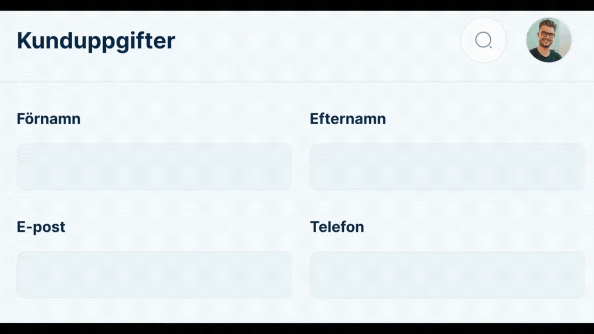
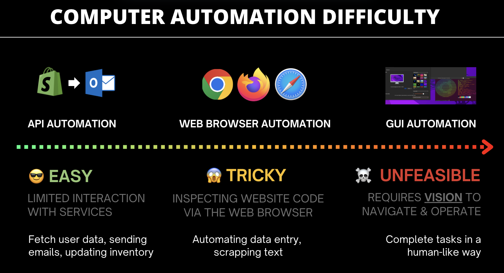
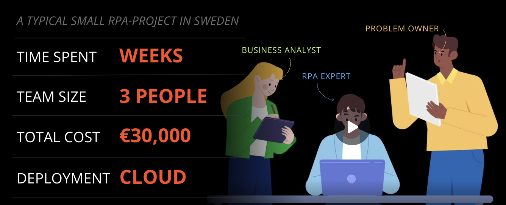
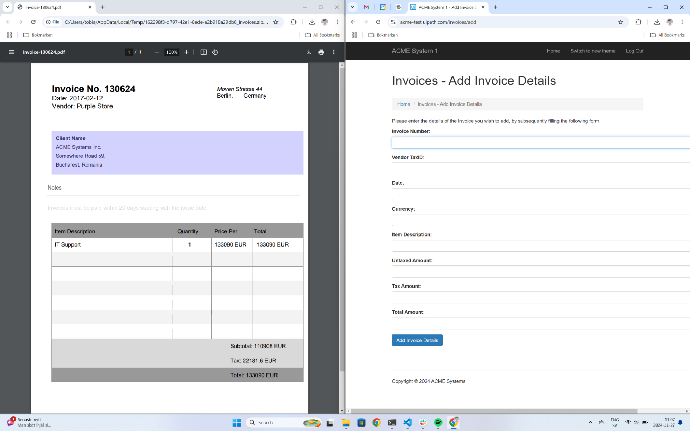
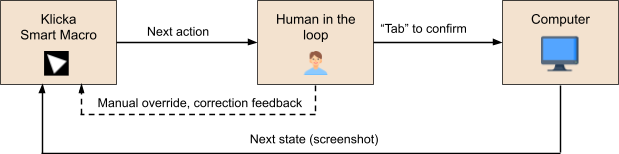
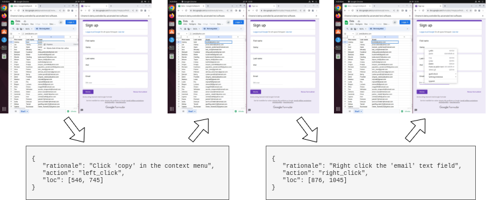
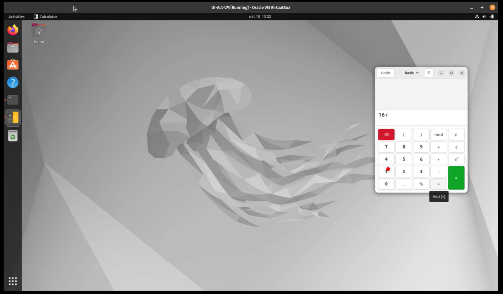
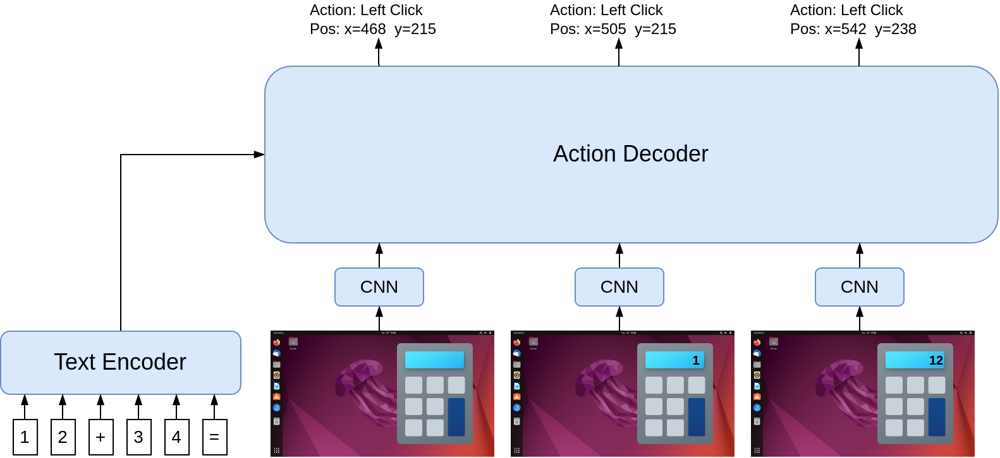
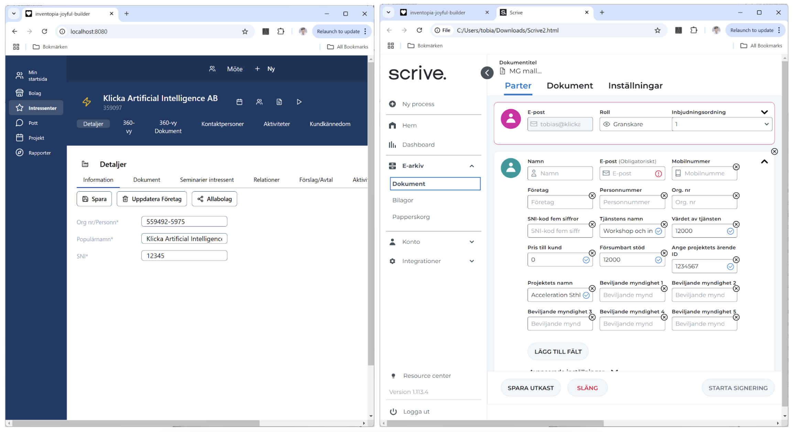
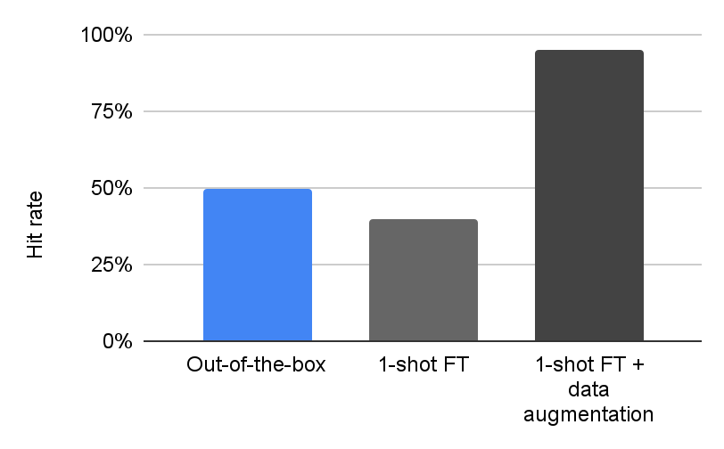

### Technical Whitepaper

# Klicka AI: Low-latency Attended Automation using On-Premise UI-Agents

**Authors:**
[Alexander Anserud](https://www.linkedin.com/in/alexander-anserud/) ¤ [Tobias Norlund](https://www.linkedin.com/in/tobiasnorlund/)

## Introduction

In today’s digitalized world, humans spend over **20 billion hours** annually on computers to perform work, and 92% of jobs involve some degree of computer work. This constitutes a significant portion of all human work in total, and with digitalization, this ratio has increased since the invention of the computer in the 20th century. The means of controlling a computer however, via mouse and keyboard input and a graphical user interface (GUI) on a screen as output, was invented in the 60’s and hasn’t changed since. The GUI has proven very effective as an interface to perform work.

One can view the mouse and keyboard as a tool of communication with the underlying computer software. While using a mouse cursor and clicking in a GUI allows for very precise control, moving the mouse takes time, and for many simple work tasks the slow interaction can be frustrating. Executing seemingly simple tasks can oftentimes take many clicks and interactions, and thus take unnecessarily long time from employees. This is especially true for repetitive and menial administrative tasks that unfortunately are commonplace in today’s digital work. In fact, a study has shown in certain professions as much as 40 percent of their day is spent on manual digital administrative processes ([ref](https://www.automationanywhere.com/company/press-room/global-research-reveals-worlds-most-hated-office-tasks)).

## Computer Automation: An Overview

When a manual and repetitive workflow is considered for automation today, the case is typically the following:

- Humans performing the task today interact with the underlying systems using the Graphical user interface (GUI)
- The task involves extracting and interpreting data that triggers different actions, in the same or in other systems
- There may or may not be Application Programming Interfaces (APIs) available to the underlying systems that allow for programmatic control.

Automating the task requires constructing a software program specifying how the task should be executed in all possible conditions. The developer can choose whether to use the GUI (e.g. simulated computer mouse and keystrokes) or APIs if they are available. When APIs are available, they are typically the preferred method of choice due to them being relatively robust compared to the GUI. The highly dynamic nature of GUIs make them challenging to develop robust automations against, even for simple tasks. This is not surprising, as GUIs have been originally designed for use by humans and not by scripts.

Despite this, early automation tools such as AutoHotKey (2003) and AutoIt (1999) were primarily using the GUI. They gained in popularity for their versatility, enabling users to customize workflows and integrate different software without needing deep programming knowledge. And this exact point – not requiring programming knowledge – is a key that has shaped the development of automation tools onwards, and as we argue, will continue to do so.

Robotic Process Automation (RPA) is today a well-established technology for automating workflows on computers. Companies such as UI Path, Blue Prism, and Automation Anywhere have created _low-code_ platforms that require less programming expertise to design and maintain automations (commonly referred to as _robots_). To address the challenges posed by dynamic graphical interfaces, RPA tools increasingly leverage programmatic interfaces (APIs) and today support a wide range of integrations to common software.

Additionally, RPA providers have developed platforms for deploying and orchestrating robots in the cloud (unattended). Unlike macros, which operate directly on a user's computer, unattended automation requires no human oversight, fully relieving employees of manual involvement.

### **Challenges in Scaling RPA**

While RPA has evolved into a multibillion-dollar industry, there are challenges that limit its scalability and adoption going forward:

1. **Deployment Complexity**: Deploying robots unattended in the cloud involves additional technical tasks such as setting up the virtual environment, software authentication and orchestration. This creates barriers for non-technical users to independently implement automations.
2. **Centralized Expertise**: Current best practice is to establish a Center of Excellence (CoE) team to consolidate this technical expertise needed for automation. While effective, this approach can create bottlenecks, as all automations spanning the whole organization must be developed and maintained by this team.

In practice, we have a situation where frontline workers with deep process expertise have to explain the workflow to an RPA developer (either directly or through an intermediary Business Analyst). This is time-intensive, as workflows are rarely fully standardized and often involve exceptions and dependencies. The outcome is a so-called Process Definition Document (PDD) – a specification that the developer can convert to a functional implementation. Any subsequent changes to the process require the involvement of the developer, who must update the implementation accordingly. Given the dynamic nature of real-world processes, such changes are frequent, making maintenance resource-intensive. Robots also often break due to updates in the underlying applications, or due to novel exceptions that were not considered in the specification, further adding to the maintenance burden of RPA.

Overall, automation of a **single workflow** can take weeks to months from conception to implementation. The labor costs start at €5,000 for the smallest workflows, and licenses at €15,000 per year. Add to that recurring maintenance expenses which can account for several thousands of euros each year. The necessity of specialized expertise throughout the automation lifecycle represents a significant obstacle to scaling automation further. The high cost-per-automation limits its applicability to larger processes with substantial repetition, where the return on investment (ROI) is clear. Smaller, less repetitive processes are often excluded due to insufficient ROI.

The root cause of RPA's high costs lies in the requirement for multiple roles and skill sets throughout the automation process. Simplifying the creation and maintenance of robots to empower employees to handle these tasks independently would unlock a new realm of automation potential – in particular for smaller and medium-sized processes.

**KLICKA AI** is poised to address this gap, offering a solution designed to simplify automation and broaden its accessibility for the frontline workers.

## Rethinking Computer Automation from the Ground Up

To make automation accessible and easy for everyone, the user experience must undergo a radical transformation. This requires:

- Returning to automation primarily through the visual GUI, enabling direct replication of the manual process. This allows for intuitive instruction and adjustment of the automation, which is essential for a simplified user experience.
- Abstracting the representation of tasks and leveraging AI for its execution, ensuring the automation operates robustly under greater variability.

### **Visual GUI Automation**

The challenges of GUI automation are well-documented after decades of experience with macro tools and RPA. The visual desktop interface, with its window management, enables flexible and parallel work with applications for human users. However, for scripts, this flexibility introduces challenges related to the interface's variability and ambiguity.

For instance, modern applications render differently based on window size, complicating the localization of the same UI element. In one window size, an element may be visible in a specific location, while in another, scrolling may be required to make it visible. Additionally, screen resolution and display scaling settings impact how applications are rendered, necessitating robustness against these variabilities for reliable automation.

Graphical interfaces also often provide multiple ways to achieve the same goal. For example, to open the Chrome Web browser application in Windows, one could click its icon in the taskbar, if available. Otherwise, one might open the Start Menu by clicking the Start button or pressing the Windows key on the keyboard, then click the Chrome icon if it appears there. If not, one could search for Chrome in the Start Menu, and so on.

Even simple actions, such as switching to an active window, can be performed in numerous ways. If the window is visible, one might click on it directly, use “Alt+Tab” to switch between applications a few times depending on the number of open windows, or click the window in the taskbar (if visible). Some applications, such as browsers, may also contain multiple tabs, requiring additional interaction to select the correct tab.

The exact clicks and key presses for seemingly trivial actions—such as opening Chrome or switching to a specific tab in another window—depend on the operating system's current state. This complexity significantly complicates automation via the visual interface, as the automation must operate reliably under all these conditions.

### **Task Representation and Agentic Execution**

Executing tasks strictly based on a preprogrammed script—a rule-based program—is highly sensitive to unforeseen deviations.

For instance, an automation that follows a preprogrammed script is highly vulnerable to unexpected interruptions, such as notifications, pop-up windows, or modal dialogs, whether from the operating system or other background programs. These interruptions can take focus in ways the script does not anticipate or detect, potentially causing the script to crash or behave unpredictably.

Humans, on the other hand, handle the variability, ambiguity, and potential interruptions of the visual interface with ease. When we learn a new task via a tutorial or screen recording, it is trivial for us to adapt if an application opens in a different way or if UI elements appear differently due to changes in window size. We rely on "common sense" to generalize these aspects effectively.

Consider the following example, where the task is to populate a form with information from an open PDF file:

This task can be performed by selecting text in the PDF (e.g. the invoice number “130624”), pressing CTRL+C to copy, clicking the corresponding text field in the form (“Invoice Number”) to select it, and then pressing CTRL+V to paste the text. However, executing this task across various configurations quickly becomes complex to represent with rule-based logic. For example, if the two tabs share a window, a tab switch is required between each copy action. Similarly, if a system notification obscures the window, that must be addressed first.

To achieve human-like generalization in automation, tasks must be described more abstractly than as a script of mouse clicks and keystrokes. For instance, the description “Fill out the form with invoice details from the open PDF file” would suffice for a human to perform the task immediately. A visual demonstration could further complement this instruction for clarity.

Interpreting and executing such abstract descriptions requires artificial intelligence (AI). By _agentic UI execution_, we refer to a new type of automation execution engine where AI translates an abstract task description into mouse clicks and keystrokes by observing the screen. This approach fundamentally differs from today’s rule-based execution.

The primary downside of agentic execution is the lack of predictability. While allowing an AI model to infer actions provides significant generality and flexibility, it is challenging to guarantee its behavior. Just as Large Language Models (LLMs) can hallucinate, these AI systems can make mistakes. Therefore, **human oversight** is essential to intervene when errors occur. As the technology matures, errors will become increasingly rare, eventually reaching a level of trust where the system can operate autonomously without supervision. This is akin to the development of autonomous cars where human oversight is critical until sufficient reliability is reached.

Rule-based automation is predictable but can still be difficult to correct when errors occur. Fixing an issue requires a deep understanding of the rule set to adjust it without impacting other previously functioning cases. In contrast, AI-based systems are data-driven, meaning their behavior is entirely learned from examples. When an error is identified, it can be fed back into the system, which can then adapt its behavior autonomously.

## The Product

Our vision is to create an intuitive tool for automating small to medium-sized manual processes, aiming to replicate the experience of training a new employee to perform a task. This is achieved by providing a linguistic explanation and demonstrating the task through one or a few examples. As this represents an entirely new product category, **Klicka** will establish strategic partnerships with early customers to explore and develop the optimal user experience while addressing their real-world challenges.

Our initial product, **Klicka Assistant**, is a desktop application enabling users to create _smart macros_ for their manual processes. These macros can then be executed on the user's computer via the graphical interface. Unlike existing macro solutions, **Klicka Assistant** focuses on simplifying the user experience while enabling significantly more robust automation through AI. Smart macros will be shareable among colleagues and operate across different computers without modification, offering scalability beyond the capabilities of current macro tools.

Initially, macros will be scripted, similar to existing tools, with a gradual transition toward agentic execution as this technology evolves. Since agentic execution requires human supervision, Klicka will initially focus on **attended automation**. To achieve meaningful productivity gains, the execution must be highly efficient. Klicka’s goal is for smart macros to execute at least **five times faster** than manual execution, delivering significant productivity improvements.

### **The Tab Concept**

Central to the Klicka user experience is the "tab concept". During the execution of a smart macro, users are presented with a visual indication of the next action (e.g., a click) directly on the screen. Pressing the **Tab** key executes the indicated action, after which the next action is immediately highlighted. The macro progresses step by step with repeated **Tab** presses. By holding down **Tab**, the macro executes at maximum speed and can be paused at any time by releasing the key.

Notably, if the highlighted action is incorrect, users can manually override by taking the mouse and clicking the correct location. This provides a feedback-loop that can automatically improve the system over time.

### **Secure and Scalable Design**

Security and privacy is a core element of Klicka’s strategy, ensuring that no data needs to leave the organization. This will be achieved through the exclusive use of open and proprietary AI models specifically tailored for this product. The solution will consist of:

1. **Frontend:** A desktop application installed on users' computers.
2. **Backend:** Includes a central data server for collecting user data and a model server for AI capabilities.

The backend will be available as a service hosted by Klicka or deployable **on-premise** at the customer’s site. The model server will require a dedicated GPU to ensure a fast and seamless user experience.

### **Summary**

- **Complement to RPA:** This tool complements RPA by empowering employees to increase their productivity through the creation of intelligent macros.
- **Simplified Deployment:** By executing attended automation directly on the user’s computer, deployment complexity associated with unattended automation is eliminated.
- **Real-Time Feedback:** Supervised execution enables live error correction—a critical feedback mechanism to improve the system over time.

|                                      | Ease of use | Scalable | Data privacy |
| :----------------------------------- | :---------: | :------: | :----------: |
| **Attended RPA / Macros**            |     ❌      |    ❌    |      ✅      |
| **Unattended RPA**                   |     ❌      |    ✅    |      ✅      |
| **Agentic automation (cloud based)** |     ✅      |    ✅    |      ❌      |
| **Agentic automation (on premise)**  |     ✅      |    ✅    |      ✅      |

## Technical Requirements

For an AI system to operate a computer and execute abstract instructions, it must possess certain capabilities. We have identified the following three AI capabilities as essential for the implementation of intelligent macros and agentic execution:

1. **UI Understanding & OCR** The ability to, from a screenshot, accurately answer questions about data and visualizations displayed, spatially relate visual objects and extract text. This is commonly measured by benchmarks such as ChartQA, TextVQA and DocVQA and SOTA models are already generally performing well on this capability, with accuracies around 85-95%.

2. **UI Element Grounding** The ability to, given a textual description, visually locate UI elements used to take action. This means being able to detect the pixel coordinates of an interactable element, such as a button, link, text field or icon. Benchmarks targeting this capability include ScreenSpot, VisualWebBench and OmniACT. This is currently a capability that is under development which has also recently been identified as a bottleneck for agentic performance ([ref](https://arxiv.org/abs/2401.01614), [ref](https://arxiv.org/abs/2410.05243), [ref](https://arxiv.org/abs/2401.10935)). However, the prerequisites for generating data towards this capability at scale exist, so we expect this to develop rapidly in the coming years.

3. **Action Planning** The ability to, given an instruction and the current and previous states, predict the next low-level action to be performed. For example, to input into a text field, the field first needs to be selected (by a click) followed by a type action. An abstract instruction like “fill in the form displayed in the browser window with data from the opened pdf”, must be translated to a sequence of low-level actions. The reasoning capability of LLMs is used to, at each step, decide on the most appropriate next action, effectively utilizing both the UI understanding and element grounding capabilities.

Vision-and-Language models (VLMs) are used to implement the above capabilities. A VLM is a special type of language model that can process visual input in addition to text. For the UI understanding, the VLM receives a screenshot along with a textual question, and returns a textual answer based on the image. For the UI grounding, the model receives a screenshot with a textual description of the element to detect, and returns pixel coordinates of where it is found. And for action planning, the VLM receives a screenshot along with a description of the task and a sequence of previous actions, and returns the next action to be performed.

These capabilities can either be developed as separate models or integrated into a single one. Below are potential technical strategies:

- S1: **Separate models for Understanding and Grounding, no Planning**  
  In this approach, execution remains scripted, but AI capabilities are leveraged specifically for element grounding and UI understanding. Existing open-source models can be employed, which enables rapid deployment without significant investment in model training.

- S2: **Integrated Planning and Understanding model with separate Grounding model**  
  Currently, the most common approach in the literature is to use a powerful foundation model, such as GPT-4o, for planning and understanding, supplemented by a separate grounding model. This approach compensates for the foundation model's limitations in grounding capabilities. However, it requires the planning model to generate textual descriptions for the grounding model, which is suboptimal and can result in compounding errors.

- S3: **Fully integrated Planning, Grounding and Understanding model**  
  An end-to-end integrated model encompassing all three capabilities has the greatest potential. This approach allows the entire system to be trained holistically, avoiding the complexities of coordinating multiple models.

AI providers such as OpenAI, Anthropic, and Google are focusing on building large, highly general models with diverse capabilities. While this enables certain synergies that improve overall model performance, these models are significantly large and expensive to operate. KLICKA AI's product demands low latency, limiting model size and, consequently, generality. However, for any given automation case, only a narrow capability is required.

Our strategy prioritizes developing small, adaptable models tailored to each automation task, which enterprises can easily train. Instead of creating a single powerful and highly general model that works "out of the box" for all scenarios, we focus on efficient, task-specific solutions.

To evaluate the feasibility of these strategies further, we have developed two proof-of-concept implementations.

## Proof of Concept \#1: **UI-Act**

Klicka has developed a proof of concept that demonstrates our capacity to design and train a fully integrated Planning, Grounding and Understanding model (strategy S1 from above), at a very small footprint. [**UI-Act**](https://github.com/Klicka-AI/klicka-action-model-poc), is a Transformer-based model trained from scratch to perform a simple demonstration task on a computer: Operating a Calculator window visible on the screen based on a given instruction:

Demo and code is available open source at: [http://www.github.com/TobiasNorlund/UI-Act](http://www.github.com/TobiasNorlund/UI-Act)

The model was trained end-to-end using expert demonstrations – sequences of screenshots and subsequent actions – and has successfully learned all three of the capabilities simultaneously:

1. **UI Understanding**:  
   The model has learned to interpret full-screen images, identify the calculator window, and read the input expression that needs to be calculated.

2. **UI Element Grounding**:  
   The model has implicitly learned Optical Character Recognition (OCR) to recognize the calculator buttons and determine their specific pixel coordiínates.

3. **Action Planning**:  
   The model has learned to predict the sequence in which buttons on the calculator should be pressed to correctly calculate the given expression. It has also learned to identify when the task is complete, allowing it to exit the execution loop.

Below is an illustration of the UI-Act architecture. The model is an encoder-decoder Transformer, where the encoder is used to represent the instruction (e.g., the arithmetic expression to be calculated in this example), and the decoder represents the sequence of screenshots, predicting an action for each.

The model contains only around 2 million parameters—making it approximately 5,000 times smaller than contemporary small LLMs (with \~10 billion parameters). This allows UI-Act to run locally on a laptop CPU at sufficiently low latency.

The development of this proof of concept has provided us with valuable insights, particularly: it is possible to compress this capability into extremely small models, small enough to run in real-time locally on a laptop. However, since the model is trained from scratch, it requires large amounts of training data—specifically demonstrations of the task—and specialized data augmentation is also necessary to ensure it operates robustly across the various states of the operating system, as has been previously described.

## Proof of Concept \#2: **Data Efficient UI Grounding**

The above-mentioned UI-Act proof of concept demonstrates that implementing a fully integrated model (strategy S3) on a small scale is entirely possible, but currently requires significant customization and data. To deliver a functional product in the short term, we deem strategy S1 to be more feasible.

We believe UI Grounding to be the most value-adding capability over existing macro solutions, and therefore chose to explore this in a second Proof of concept. Specifically, we explore the **accuracy** and **latency** of a state-of-the-art UI grounding model: [**PaliGemma-WaveUI**](http://agentsea/paligemma-3b-ft-waveui-896) and evaluate against our product requirements. Klicka’s product requires an accuracy of near 100% and latency below 500ms for rapid execution.

We evaluate the model on a real customer workflow, in this use case, a data entry task where data from a CRM system (left window) is used to populate a form (right window):

This task involves selecting text fields in the left window, copying the data, and then selecting corresponding fields in the right window to paste it. To perform the task, the fields must be accurately located on the screen, regardless of the positioning or size of the windows.

In this case, the model successfully locates only 50% of the UI elements when used out-of-the-box, reflecting the current performance level of the best open models in this capability. However, with fine-tuning using demonstration data and data augmentation for translation invariance, the accuracy improves to nearly 100%. This result suggests a grounding model can be tuned to perform satisfactory for specific automation cases, a process that can be automated.

The primary challenge is latency. Since Klicka's product operates in an attended mode, execution speed is critical, requiring predictions to be completed in under 500ms. PaliGemma-WaveUI, with its 3 billion parameters, takes approximately 2.1 seconds per prediction when hosted on an NVIDIA A100 GPU. This latency dominates the total user wait time, as illustrated below:

The conclusion is that the inference time for the grounding model must be significantly reduced, which means the model size needs to be decreased.

## Strategy and Technical Roadmap

Klicka's product strategy is centered on delivering value to customers as early as possible, even during the initial stages of development. We believe in iteratively developing and improving the solution while customers actively use it, rather than awaiting the fully agentic solution to be perfected. To this end, we are forming strategic partnerships with early customers to develop the product and its capabilities based on real-world needs. These strategic partnerships will span 12 months, with the first 6 months focused on co-developing intelligent macros for specific use cases. The subsequent 6 months will focus on scaling these macros to more users and ensuring their functionality across diverse environments.

Our first Minimum Viable Product (MVP) will be implemented using the modular strategy (S1), with a focus on fast and robust UI grounding to address initial customer cases. Our hypothesis is that value can be delivered even with this limited capability. Achieving this will require improving the speed of the UI grounding capability, as evaluated in PoC\#2, which will be a major focus during 2025\. Following this, we will work toward implementing a fully integrated strategy (S3) and agentic execution to elevate the product to the next level.

## The Future, Competition, and Moat

The capabilities of agentic execution are already being developed within the foundation models of major AI providers. This will be exposed both through their APIs (e.g. Anthropic Computer Use) and via proprietary automation products (e.g. Open AI Operator and Google Mariner). However, due to the high risks associated with autonomous UI execution, these solutions will be rolled out gradually and initially in very limited forms.

OpenAI and Anthropic emphasize their results on benchmarks such as WebVoyager and OSWorld in their product release statements, showcasing their agents' capabilities in **consumer-focused tasks**. However, these benchmarks primarily assess performance on tasks like online shopping, travel booking, and basic OS interactions — areas that, while important, do not reflect the complexities of business workflow automation. Our approach targets enterprise processes that require deeper contextual understanding, multi-step reasoning, and integration with specialized business systems. Unlike consumer-oriented automation, these tasks demand a higher level of adaptability, domain-specific intelligence, and the ability to process and retain complex contextual information over extended workflows — capabilities that current benchmarks fail to capture.

In contrast, Klicka targets the automation of **business workflows** with the ability to operate across the entire desktop from the outset, providing a broader scope of functionality such as within legacy systems at Fortune 500 companies compared to only browser-focused solutions. RPA/Agents is one of the fastest-growing sectors, with total spending projected to exceed $150 billion by 2032\.

Widespread adoption will not happen overnight and it will take time, both for the technology to be entirely autonomous as well as for the users to understand and adapt to these new tools. User data will be critical for improving and advancing these tools over time. This includes information about how users work on their computers, i.e. which applications and interfaces are used, and how they are used. Such data can enable customization and personalization of the experience for each user. For example, this could make it possible to handle high-level instructions like "Enter the details from this invoice PDF into the Visma accounting system" without requiring detailed explanations of the steps involved. By understanding how tasks are typically performed, the system can execute increasingly abstract instructions effectively.

Klicka aims to build a solution where this data is collected and stored locally for each customer, enabling functionality without sharing sensitive information with external providers. This approach is comparable to how local Retrieval-Augmented Generation (RAG) solutions are built on top of open Large Language Models (LLMs) today.

By offering a solution that continually improves with usage and adapts to individual users, Klicka increases the barrier for customers to switch providers, creating a sustainable competitive advantage. Over time, improved personalization and ongoing refinement ensure that Klicka remains a critical tool for its users, securing long-term customer loyalty and market differentiation.
